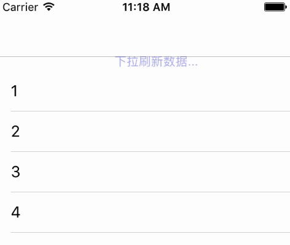

# DxRefreshView_OC

模仿锤子手机的下拉刷新效果


Demo:
---



Usage:
---

```Swift
_scrollView = [[UIScrollView alloc] initWithFrame:self.view.bounds];
DxRefreshView *refreshHeader = [[DxRefreshView alloc] init];
refreshHeader.color = [UIColor blueColor];
refreshHeader.actionHandler = ^{
     //刷新数据
};
```

刷新完成之后：

```Swift
[_scrollView.refreshHeader endRefreshing];
```

不通过下拉触发，直接开始刷新:

```Swift
[_scrollView.refreshHeader beginRefreshing];
```


[# swift版本](https://github.com/StevenDXC/DxRefreshView) 
---
